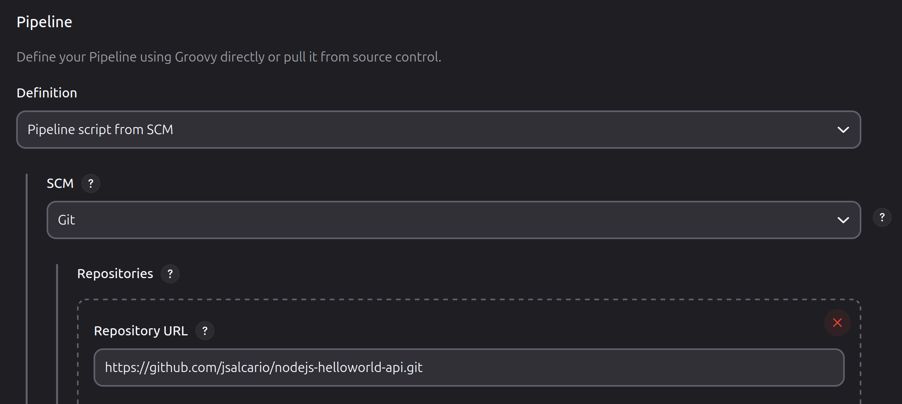
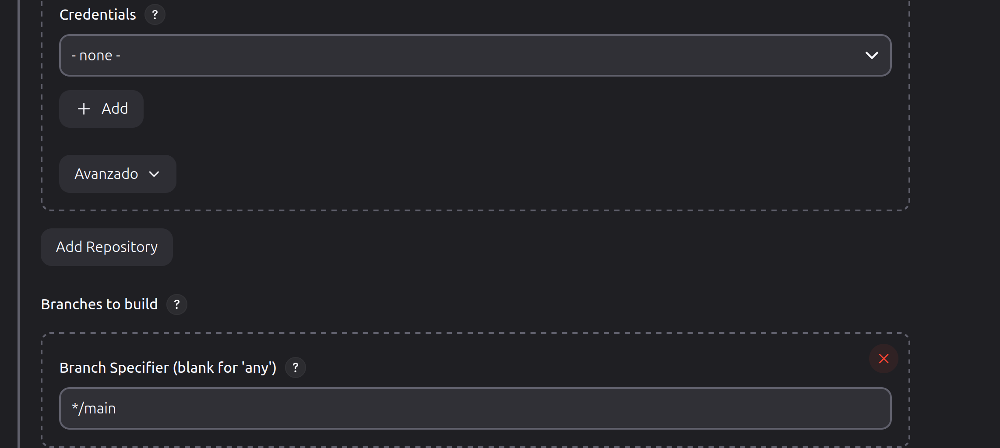
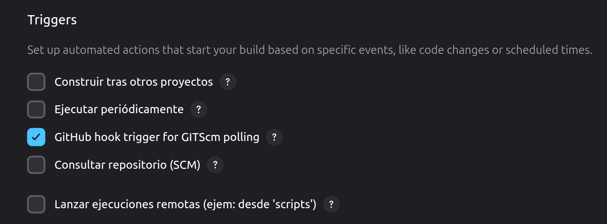
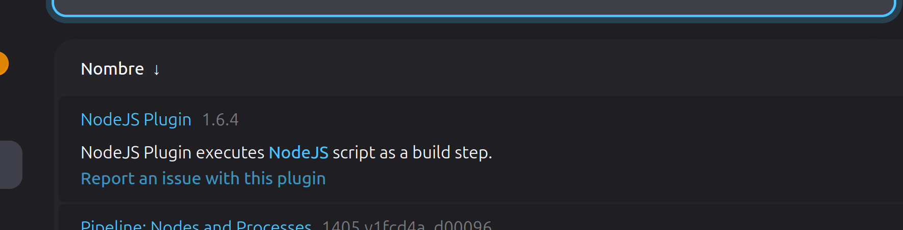
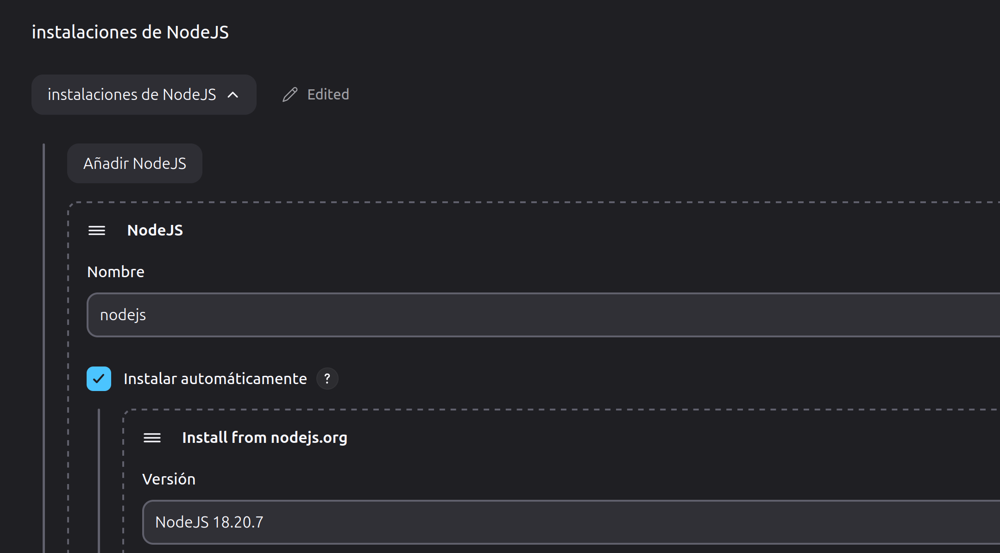
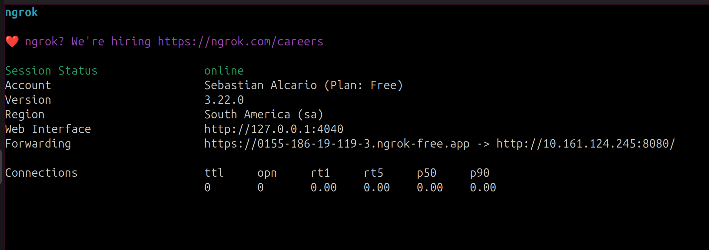
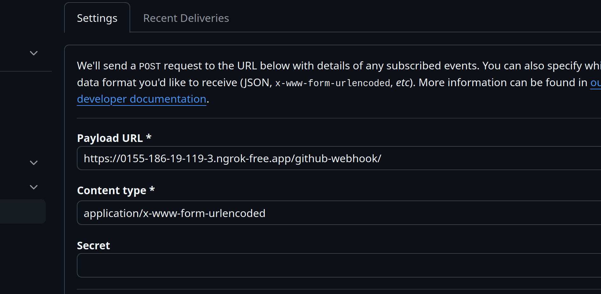

# Desafio2: Guia de configuracion y uso del job:

## Paso 1:
Creación del pipeline y configuración:
asociar el Jenkinsfile del repositorio, sin credenciales ya que es un repositorio público y utilizamos la rama main.






En Triggers marcamos el casillero "GitHub hook trigger for GITScm polling" que se usara mas adelante para la configuracion del webhook.



## Paso 2:
Instalar en Jenkins el plugin de NodeJs y configurarlo:
Para eso iremos a Administrar Jenkins>Plugins y buscamos Nodejs:



Luego de su instalación iremos a Administrar Jenkins> Tools y añadimos una configuracion de Nodejs, aplicamos y guardamos.



## Paso 3:
Exponer la url privada en ngrok:
(previamente a esto se tuvo que crear cuenta en ngrok, instalarlo y añadir la clave token)
abrimos terminal donde esta ubicado Jenkins:
```bash
ngrok http http://localhost:8080/
```


aparecera este resultado en la terminal y copiamos la url que termina ngrok-free.app

## Paso 4:
Configurar el repositorio añadiendo un weebhook:
Nos ubicamos en el repositorio de github y vamos a Settings > Webhooks > addwebhook y en Payloadurl pegamos la url que nos dio ngrok y hacemos click en Update webhook



El job ya esta listo para usar, cada vez que se actualice y se haga un commit en la rama main un webhook se dispara y se registra en los Github Hook Log.

cambios


